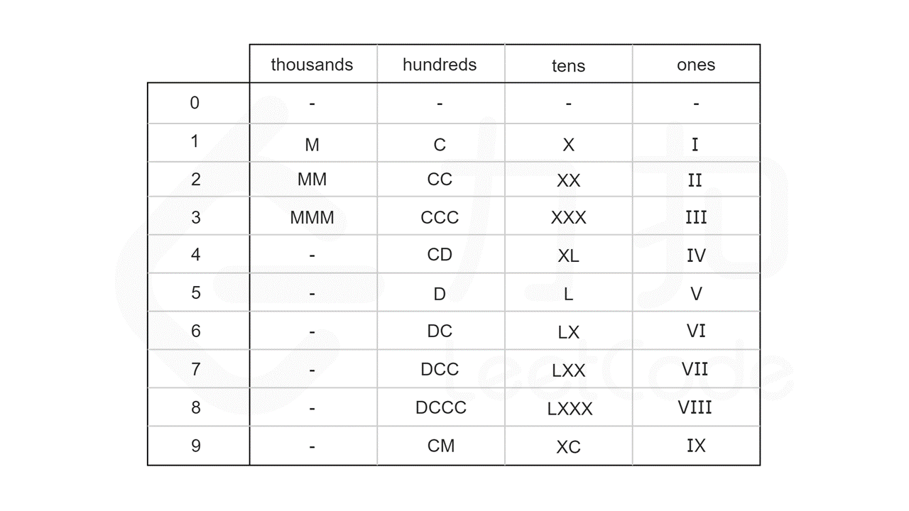

# 12. Integer to Roman（整数转罗马数字）

## 方法1：模拟法

### 思路与算法

根据罗马数字的唯一表示法，为了表示一个给定的整数 num，我们寻找不超过 num 的最大符号值，将 num 减去该符号值，然后继续寻找不超过 num 的最大符号值，将该符号拼接在上一个找到的符号之后，循环直至 num 为 0，最后得到的字符串即为 num 的罗马数字表示。

编程时，可以建立一个数值-符号对的列表 valueSymbols，按数值从大到小排列。遍历 valueSymbols 中的每个数值-符号对，若当前数值 value 不超过 num，则从 num 中不断减去 value，直至 num 小于 value，然后遍历下一个数值-符号对。若遍历中 num 为 0 则跳出循环。

### 复杂度分析

时间复杂度：O(1)。由于 valueSymbols 长度是固定的，且这 13 字符中的每个字符的出现次数均不会超过 3，因此循环次数有一个确定的上限。对于本题给出的数据范围，循环次数不会超过 15 次。

空间复杂度：O(1)。

### C++ 解法一

```c++
const pair<int, string> valueSymbols[] = {
    {1000, "M"},
    {900,  "CM"},
    {500,  "D"},
    {400,  "CD"},
    {100,  "C"},
    {90,   "XC"},
    {50,   "L"},
    {40,   "XL"},
    {10,   "X"},
    {9,    "IX"},
    {5,    "V"},
    {4,    "IV"},
    {1,    "I"}
};

class Solution {
public:
    string intToRoman(int num) {
        string roman;
        for (const auto& [value, symbol] : valueSymbols) {
            while (num >= value) {
                num -= value;
                roman += symbol;
            }
            if (num == 0) {
                break;
            }
        }
        return roman;
    }
};
```

## 方法2：硬编码数字法

### 思路与算法

回顾上面方法中列出的这 13 个符号，可以发现：

```python
千位数字只能由 M 表示；
百位数字只能由 C，CD，D 和 CM 表示；
十位数字只能由 X，XL，L 和 XC 表示；
个位数字只能由 I，IV，V 和 IX 表示。
```

这恰好把这 13 个符号分为四组，且组与组之间没有公共的符号。因此，整数 num 的十进制表示中的每一个数字都是可以单独处理的。进一步地，我们可以计算出每个数字在每个位上的表示形式，整理成一张硬编码表。如下图所示，其中 0 对应的是空字符串。

利用模运算和除法运算，我们可以得到 num 每个位上的数字：

```c++
thousands_digit = num / 1000
hundreds_digit = (num % 1000) / 100
tens_digit = (num % 100) / 10
ones_digit = num % 10
```


最后，根据 num 每个位上的数字，在硬编码表中查找对应的罗马字符，并将结果拼接在一起，即为 num 对应的罗马数字。

### 复杂度分析

时间复杂度：O(1)。空间复杂度：O(1)。

### C++ 解法二

```c++
const string thousands[] = { "", "M", "MM", "MMM" };
const string hundreds[] = { "", "C", "CC", "CCC", "CD", "D", "DC", "DCC", "DCCC", "CM" };
const string tens[] = { "", "X", "XX", "XXX", "XL", "L", "LX", "LXX", "LXXX", "XC" };
const string ones[] = { "", "I", "II", "III", "IV", "V", "VI", "VII", "VIII", "IX" };

class Solution {
public:
	string intToRoman(int num) {
		return thousands[num / 1000] + hundreds[num % 1000 / 100] + tens[num % 100 / 10] + ones[num % 10];
	}
};
```


