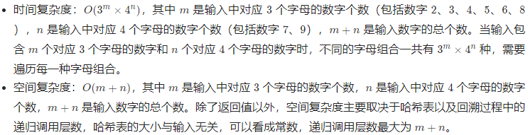

# 17. Letter Combinations of a Phone Number（ 电话号码的字母组合）

## 方法1：回溯法

### 思路与算法

首先使用哈希表存储每个数字对应的所有可能的字母，然后进行回溯操作。

回溯过程中维护一个字符串，表示已有的字母排列（如果未遍历完电话号码的所有数字，则已有的字母排列是不完整的）。该字符串初始为空。每次取电话号码的一位数字，从哈希表中获得该数字对应的所有可能的字母，并将其中的一个字母插入到已有的字母排列后面，然后继续处理电话号码的后一位数字，直到处理完电话号码中的所有数字，即得到一个完整的字母排列。然后进行回退操作，遍历其余的字母排列。

回溯算法用于寻找所有的可行解，如果发现一个解不可行，则会舍弃不可行的解。在这道题中，由于每个数字对应的每个字母都可能进入字母组合，因此不存在不可行的解，直接穷举所有的解即可。

### 复杂度分析



### C++ 解法一

```c++
class Solution {
public:
    vector<string> letterCombinations(string digits) {
        vector<string> combinations;
        if (digits.empty()) {
            return combinations;
        }
        unordered_map<char, string> phoneMap{
            {'2', "abc"},
            {'3', "def"},
            {'4', "ghi"},
            {'5', "jkl"},
            {'6', "mno"},
            {'7', "pqrs"},
            {'8', "tuv"},
            {'9', "wxyz"}
        };
        string combination;
        backtrack(combinations, phoneMap, digits, 0, combination);
        return combinations;
    }

    void backtrack(vector<string>& combinations, const unordered_map<char, string>& phoneMap, const string& digits, int index, string& combination) {
        if (index == digits.length()) {
            combinations.push_back(combination);
        } else {
            char digit = digits[index];
            const string& letters = phoneMap.at(digit);
            for (const char& letter: letters) {
                combination.push_back(letter);
                backtrack(combinations, phoneMap, digits, index + 1, combination);
                combination.pop_back();
            }
        }
    }
};
```
