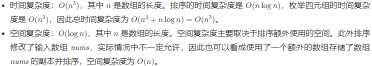

# 18. 4Sum

## 方法1：排序+双指针

### 思路与算法

最朴素的方法是使用四重循环枚举所有的四元组，然后使用哈希表进行去重操作，得到不包含重复四元组的最终答案。假设数组的长度是 n，则该方法中，枚举的时间复杂度为O(n<sup>4</sup>)，去重操作的时间复杂度和空间复杂度也很高，因此需要换一种思路。

为了避免枚举到重复四元组，则需要保证每一重循环枚举到的元素不小于其上一重循环枚举到的元素，且在同一重循环中不能多次枚举到相同的元素。

为了实现上述要求，可以对数组进行排序，并且在循环过程中遵循以下两点：
（1）每一种循环枚举到的下标必须大于上一重循环枚举到的下标；
（2）同一重循环中，如果当前元素与上一个元素相同，则跳过当前元素。

使用上述方法，可以避免枚举到重复四元组，但是由于仍使用四重循环，时间复杂度仍是O(n<sup>4</sup>)。注意到数组已经被排序，因此可以使用双指针的方法去掉一重循环。

使用两重循环分别枚举前两个数，然后在两重循环枚举到的数之后使用双指针枚举剩下的两个数。假设两重循环枚举到的前两个数分别位于下标 i 和 j，其中 i<j。初始时，左右指针分别指向下标 j+1和下标 n-1。每次计算四个数的和，并进行如下操作：

- 如果和等于 target，则将枚举到的四个数加到答案中，然后将左指针右移直到遇到不同的数，将右指针左移直到遇到不同的数；


- 如果和小于 target，则将左指针右移一位；


- 如果和大于 target，则将右指针左移一位。


使用双指针枚举剩下的两个数的时间复杂度是 O(n)，因此总时间复杂度是O(n<sup>3</sup>)，低于O(n<sup>4</sup>)。

具体实现时，还可以进行一些剪枝操作：

- 在确定第一个数之后，如果 nums[i] + nums[i + 1] + nums[i + 2] + nums[i + 3] > target，说明此时剩下的三个数无论取什么值，四数之和一定大于 target，因此退出第一重循环；
- 在确定第一个数之后，如果 nums[i] + nums[n - 3] + nums[n - 2] + nums[n - 1] < target，说明此时剩下的三个数无论取什么值，四数之和一定小于 target，因此第一重循环直接进入下一轮，枚举 nums[i + 1]；
- 在确定前两个数之后，如果 nums[i] + nums[j] + nums[j + 1] + nums[[j + 2] < target，说明此时剩下的两个数无论取什么值，四数之和一定大于 target，因此退出第二重循环；
- 在确定前两个数之后，如果 nums[i] + nums[j] + nums[n - 2] + nums[n - 1] < target，说明此时剩下的两个数无论取什么值，四数之和一定小于 target，因此第二重循环直接进入下一轮，枚举 nums[j+1]。

### 复杂度分析



### C++ 解法一

```c++
class Solution {
public:
    vector<vector<int>> fourSum(vector<int>& nums, int target) {
        vector<vector<int>> quadruplets;
        if (nums.size() < 4) {
            return quadruplets;
        }
        sort(nums.begin(), nums.end());
        int length = nums.size();
        for (int i = 0; i < length - 3; i++) {
            if (i > 0 && nums[i] == nums[i - 1]) {
                continue;
            }
            if ((long) nums[i] + nums[i + 1] + nums[i + 2] + nums[i + 3] > target) {
                break;
            }
            if ((long) nums[i] + nums[length - 3] + nums[length - 2] + nums[length - 1] < target) {
                continue;
            }
            for (int j = i + 1; j < length - 2; j++) {
                if (j > i + 1 && nums[j] == nums[j - 1]) {
                    continue;
                }
                if ((long) nums[i] + nums[j] + nums[j + 1] + nums[j + 2] > target) {
                    break;
                }
                if ((long) nums[i] + nums[j] + nums[length - 2] + nums[length - 1] < target) {
                    continue;
                }
                int left = j + 1, right = length - 1;
                while (left < right) {
                    long sum = (long) nums[i] + nums[j] + nums[left] + nums[right];
                    if (sum == target) {
                        quadruplets.push_back({nums[i], nums[j], nums[left], nums[right]});
                        while (left < right && nums[left] == nums[left + 1]) {
                            left++;
                        }
                        left++;
                        while (left < right && nums[right] == nums[right - 1]) {
                            right--;
                        }
                        right--;
                    } else if (sum < target) {
                        left++;
                    } else {
                        right--;
                    }
                }
            }
        }
        return quadruplets;
    }
};
```
