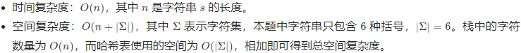

# 20. Valid Parentheses

## 方法1：栈

### 思路与算法

判断括号的有效性可以使用「栈」这一数据结构来解决。

我们遍历给定的字符串 s。当我们遇到一个左括号时，我们会期望在后续的遍历中，有一个相同类型的右括号将其闭合。由于后遇到的左括号要先闭合，因此我们可以将这个左括号放入栈顶。

当我们遇到一个右括号时，我们需要将一个相同类型的左括号闭合。此时，我们可以取出栈顶的左括号并判断它们是否是相同类型的括号。如果不是相同的类型，或者栈中并没有左括号，那么字符串 s 无效，返回 False。为了快速判断括号的类型，我们可以使用哈希表存储每一种括号。哈希表的键为右括号，值为相同类型的左括号。

在遍历结束后，如果栈中没有左括号，说明我们将字符串 s 中的所有左括号闭合，返回 True，否则返回 False。

注意到有效字符串的长度一定为偶数，因此如果字符串的长度为奇数，我们可以直接返回 False，省去后续的遍历判断过程。

### 复杂度分析



### C++ 解法一

```c++
class Solution {
public:
    bool isValid(string s) {
        int n = s.size();
        if (n % 2 == 1) {
            return false;
        }

        unordered_map<char, char> pairs = {
            {')', '('},
            {']', '['},
            {'}', '{'}
        };
        stack<char> stk;
        for (char ch: s) {
            if (pairs.count(ch)) {
                if (stk.empty() || stk.top() != pairs[ch]) {
                    return false;
                }
                stk.pop();
            }
            else {
                stk.push(ch);
            }
        }
        return stk.empty();
    }
};
```

