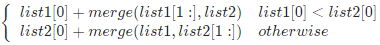
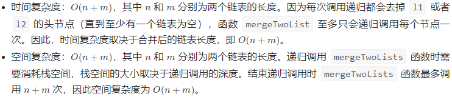

# 21. Merge Two Sorted Lists（合并两个有序链表）

## 前言

复杂问题的求解过程常常包含基本操作的多次重复进行，重复基本操作的常用方式有迭代和递归。

迭代一般采用循环结构，通过某种递推式，不断更新变量新值，直到得到问题的解。

递归则是算法中存在自调用，将大问题化为相同结构的小问题来求解，递归是一种有效的算法设计方法，是解决许多复杂问题的重要方法。

## 方法1：递归

### 思路与算法

我们可以如下递归地定义两个链表里的 merge 操作（忽略边界情况，比如空链表等）：



也就是说，两个链表头部值较小的一个节点与剩下元素的 merge 操作结果合并。

我们直接将以上递归过程建模，同时需要考虑边界情况。如果 l1 或者 l2 一开始就是空链表 ，那么没有任何操作需要合并，所以我们只需要返回非空链表。否则，我们要判断 l1 和 l2 哪一个链表的头节点的值更小，然后递归地决定下一个添加到结果里的节点。如果两个链表有一个为空，递归结束。

### 复杂度分析



### C++ 解法一

```c++
class Solution {
public:
    ListNode* mergeTwoLists(ListNode* l1, ListNode* l2) {
        if (l1 == nullptr) {
            return l2;
        } else if (l2 == nullptr) {
            return l1;
        } else if (l1->val < l2->val) {
            l1->next = mergeTwoLists(l1->next, l2);
            return l1;
        } else {
            l2->next = mergeTwoLists(l1, l2->next);
            return l2;
        }
    }
};
```

## 方法2：迭代

### 思路与算法

我们可以用迭代的方法来实现上述算法。当 l1 和 l2 都不是空链表时，判断 l1 和 l2 哪一个链表的头节点的值更小，将较小值的节点添加到结果里，当一个节点被添加到结果里之后，将对应链表中的节点向后移一位。

首先，我们设定一个哨兵节点 prehead ，这可以在最后让我们比较容易地返回合并后的链表。我们维护一个 prev 指针，我们需要做的是调整它的 next 指针。然后，我们重复以下过程，直到 l1 或者 l2 指向了 null ：如果 l1 当前节点的值小于等于 l2 ，我们就把 l1 当前的节点接在 prev 节点的后面同时将 l1 指针往后移一位。否则，我们对 l2 做同样的操作。不管我们将哪一个元素接在了后面，我们都需要把 prev 向后移一位。

在循环终止的时候， l1 和 l2 至多有一个是非空的。由于输入的两个链表都是有序的，所以不管哪个链表是非空的，它包含的所有元素都比前面已经合并链表中的所有元素都要大。这意味着我们只需要简单地将非空链表接在合并链表的后面，并返回合并链表即可。

### 复杂度分析


### C++ 解法二

```c++
class Solution {
public:
    ListNode* mergeTwoLists(ListNode* l1, ListNode* l2) {
        ListNode* preHead = new ListNode(-1);

        ListNode* prev = preHead;
        while (l1 != nullptr && l2 != nullptr) {
            if (l1->val < l2->val) {
                prev->next = l1;
                l1 = l1->next;
            } else {
                prev->next = l2;
                l2 = l2->next;
            }
            prev = prev->next;
        }

        // 合并后 l1 和 l2 最多只有一个还未被合并完，我们直接将链表末尾指向未合并完的链表即可
        prev->next = l1 == nullptr ? l2 : l1;

        return preHead->next;
    }
};
```