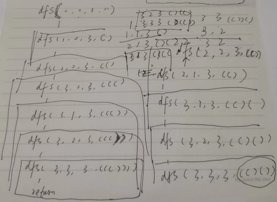

# 22. Generate Parentheses（括号生成）

## 方法1：递归

### 思路与算法

一般针对列出符合条件的括号序列的问题有一个充要条件，包括两点：

- 任意前缀的 "(" 数量 >=  ")" 数量 ;

- 左右括号数量相等。

针对上述思路，我们定义 dfs 函数如下：
函数参数为：当前括号序列的左括号数量 lc，右括号数量 rc，给定的 n，当前的括号序列 seq；
搜索的终止条件为：lc == n && rc == n，此时将当前 seq 添加到结果中即可，然后 return。否则，尝试在当前序列后面添加左括号或者右括号。如果左括号存在，则一定可以添加到括号序列中。如果右括号存在，则也一定可以添加到括号序列中，需要注意的是，此时 lc 必须大于 rc，这样才能保证添加完成后，左括号的数量大于等于右括号的数量。



### 复杂度分析

时间复杂度：经典的卡特兰数问题，因此时间复杂度为 O ((1/(n+1)·C(2n,n)) = O (C(2n,n))；

空间复杂度：我们所需要的空间取决于递归栈的深度，每一层递归函数需要 O(1) 的空间，最多递归 2n 层，因此空间复杂度为 O(n)。

### C++ 解法一

```c++
class Solution {
    vector<string> ans;
public:
    vector<string> generateParenthesis(int n) {
        generateParenthesisDFS(0, 0, n, "");
        return ans;
    }

    void generateParenthesisDFS(int lc, int rc, int n, string seq) {
        if (lc == n && rc == n) {
            ans.push_back(seq);
            return;
        }
        if (lc < n)
            generateParenthesisDFS(lc + 1, rc, n, seq + '(');
        if (rc < n && lc > rc)
            generateParenthesisDFS(lc, rc + 1, n, seq + ')');
    }
};
```
