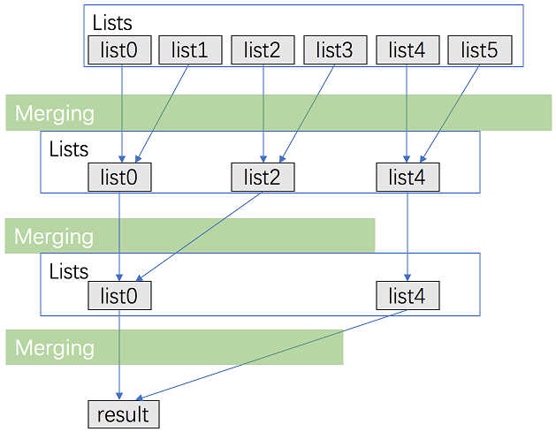
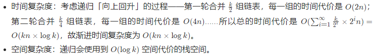

# 23. Merge k Sorted Lists

## 方法1：顺序合并

### 思路与算法

该题的基础模型即[21. Merge Two Sorted Lists](https://github.com/crossoverpptx/LeetCode/tree/main/21. Merge Two Sorted Lists)，因此可以顺序完成2个链表的合并，直至第 k 个链表。

### 复杂度分析


### C++ 解法一

```c++
class Solution {
public:
    ListNode* mergeKLists(vector<ListNode*>& lists) {
        ListNode *ans = nullptr;
        for (size_t i = 0; i < lists.size(); ++i) {
            ans = mergeTwoLists(ans, lists[i]);
        }
        return ans;
    }

    ListNode* mergeTwoLists(ListNode* l1, ListNode* l2) {
        ListNode* preHead = new ListNode(-1);

        ListNode* prev = preHead;
        while (l1 != nullptr && l2 != nullptr) {
            if (l1->val < l2->val) {
                prev->next = l1;
                l1 = l1->next;
            } else {
                prev->next = l2;
                l2 = l2->next;
            }
            prev = prev->next;
        }

        // 合并后 l1 和 l2 最多只有一个还未被合并完，我们直接将链表末尾指向未合并完的链表即可
        prev->next = l1 == nullptr ? l2 : l1;

        return preHead->next;
    }
};
```

## 方法2：分治合并

### 思路与算法

考虑优化方法1，用分治的方法进行合并。

- 将k 个链表配对并将同一对中的链表合并；
- 第一轮合并以后， k 个链表被合并成了 k/2 个链表，平均长度为 2n/k ，然后是  k/4 个链表，8/k 个链表等等；
- 重复这一过程，直到我们得到了最终的有序链表。



### 复杂度分析



### C++ 解法二

```c++
class Solution {
public:
    ListNode* mergeKLists(vector<ListNode*>& lists) {
        return merge(lists, 0, lists.size() - 1);
    }

    ListNode* merge(vector<ListNode*> &lists, int l, int r) {
        if (l == r) return lists[l];
        if (l > r) return nullptr;    // 该情况貌似不会出现？错！这是递归退出条件，只是什么条件下会出现这种情况呢。
        int mid = (l + r) >> 1; // 比特操作，相当于除以2
        return mergeTwoLists(merge(lists, l, mid), merge(lists, mid + 1, r));
    }

    ListNode* mergeTwoLists(ListNode* l1, ListNode* l2) {
        ListNode* preHead = new ListNode(-1);

        ListNode* prev = preHead;
        while (l1 != nullptr && l2 != nullptr) {
            if (l1->val < l2->val) {
                prev->next = l1;
                l1 = l1->next;
            } else {
                prev->next = l2;
                l2 = l2->next;
            }
            prev = prev->next;
        }

        // 合并后 l1 和 l2 最多只有一个还未被合并完，我们直接将链表末尾指向未合并完的链表即可
        prev->next = l1 == nullptr ? l2 : l1;

        return preHead->next;
    }
};

```

