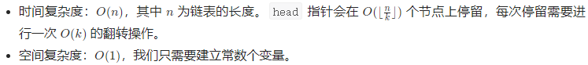

# 25. Reverse Nodes in k-Group（K 个一组翻转链表）

## 方法1：模拟

### 思路与算法

整个模拟过程分为两步：一、分组；二、翻转。

一、分组：对于每一个组，我们需要设置一个pre节点、start节点、end节点、next节点。

二、翻转：首先进行组内翻转，设置curr节点指向start节点，只要curr不为空，持续修改节点指向，直到curr为空，本组翻转结束。然后，将pre节点、翻转后的组、next节点拼接成大链表，重复上述步骤直到链表为空。若是剩余节点不足k个，则不用翻转，直接返回大链表即可。

### 复杂度分析



### C++ 解法一

```c++
class Solution {
public:
    ListNode* reverse(ListNode* head) {
        ListNode* pre = nullptr, * curr = head, * next = nullptr;
        while(curr != nullptr) {
            next = curr->next;
            curr->next = pre;
            pre = curr;
            curr = next;
        }
        // 返回新链表的头结点
        return pre;
    }

    ListNode* reverseKGroup(ListNode* head, int k) {
        // 添加dummy节点，来记住整个链表的头结点，最后返回此节点
        ListNode* dummy = new ListNode(0);
        dummy->next = head;
        ListNode* pre = dummy, * start = head, * end = head, * next = head;
        while(next != nullptr) {
            // 根据k找到end，注意链表是否结束
            for(int i = 1; i < k && end != nullptr; i++) {
                end = end->next;
            }
            // 如果链表的尾部没有k的整数倍，跳出while循环
            if(end == nullptr) {
                break;
            }
            // 翻转区进行翻转
            next = end->next;
            end->next = nullptr;
            end = start;
            start = reverse(start);
            end->next = next;
            pre->next = start;
            // 重新指定pre，start，end
            pre = end;
            start = next;
            end = start;
        }
        return dummy->next;
    }
};
```

